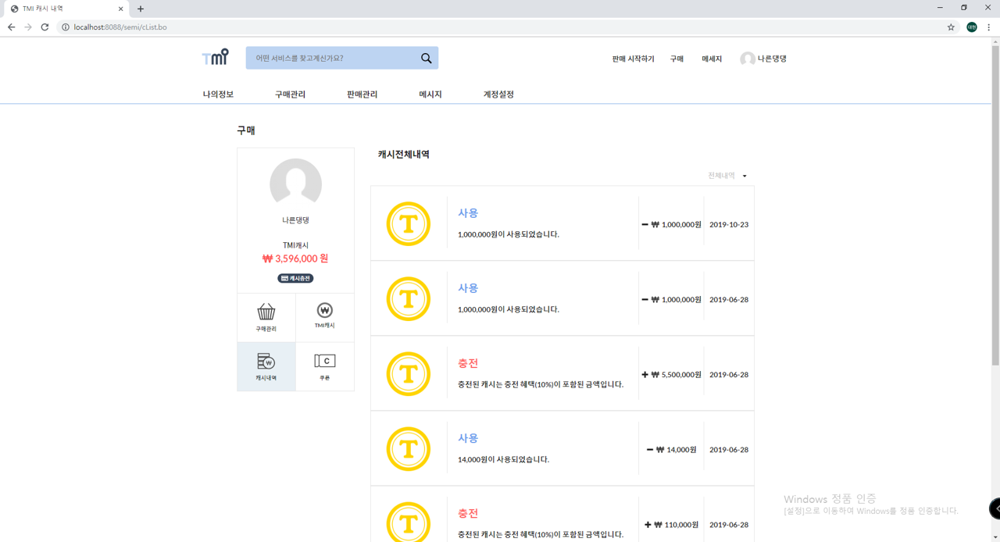
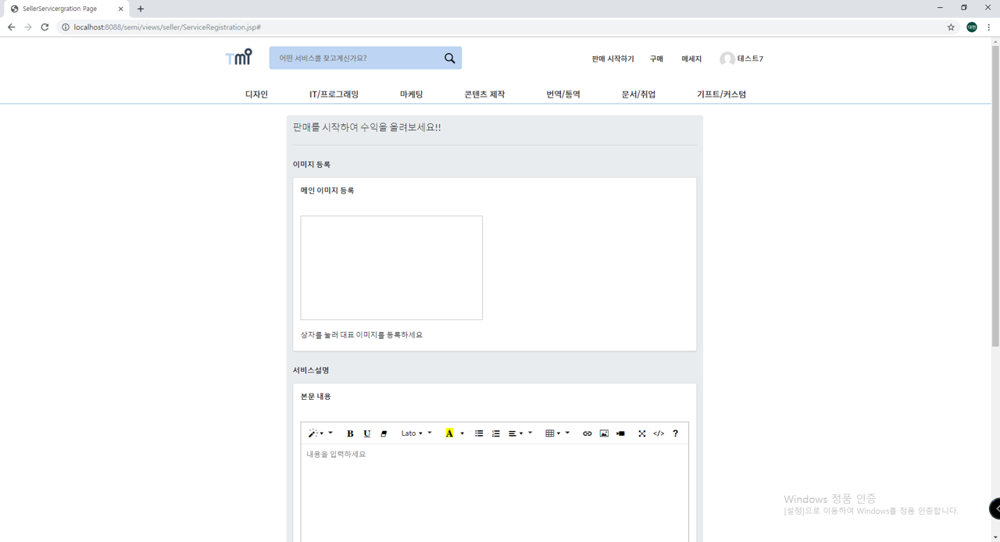
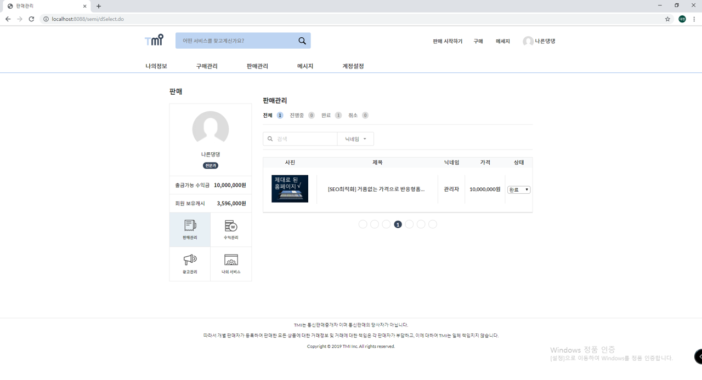
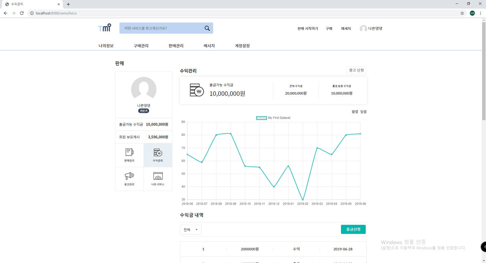

# TMI_Project
누구나 재능을 판매할 수 있고, 구매할 수 있는 여러 카테고리의 다양한 재능들을 상품으로서 판매, 거래, 공유를 할 수 있는 사이트입니다.
 
 

## Overview

## Skills

## 회원 관련 기능
### 회원가입
회원가입시 해야하는 기본적인 유효성검사를 하였습니다.
* 이메일, 이름, 비밀번호, 비밀번호 확인, 주민등록번호, 닉네임, 핸드폰번호를 입력받고 해당 데이터가 입력되지 않았을 경우 해당 태그에 포커싱되게 하고 회원가입이 되지 않게 하였습니다.
* 이메일은 ex) test@gmail.com 처럼 @ 앞에 아이디 뒤에 메일주소를 입력하지 않으면 회원가입이 되지 않도록 하였습니다.
* 회원정보 등록시 DB에서 이메일의 중복 여부를 체크하여 중복되어있을 경우 중복된 이메일이라는 경고창과 함께 회원가입이 되지 않도록 하였습니다.
* 이름은 2~10글자 이내로 한글 및 영문만 입력하게 하였습니다.
* 비밀번호와 비밀번호 확인은 영문+숫자+특수문자 조합으로 8~16이내의 정보를 입력하지 않거나 둘의 값이 다를 경우 회원가입이 되지 않도록 하였습니다.
  

### 로그인
이메일과 비밀번호 조회결과를 체크합니다.
* 아이디, 비밀번호를 입력하였는지 공백여부를 체크합니다.
* 로그인 정보가 DB정보와 일치하지 않는다면 아이디가 틀렸는지 비밀번호가 틀렸는지의 경우를 따로 알려줍니다.
* 로그인을 하지 않을경우 구매,판매 서비스를 이용할 수 없게 하였습니다.
  

  
네이버 및 카카오 아이디로 로그인을 할 수 있도록 하였습니다.
* 가입되어 있지 않다면 회원가입페이지로 이동하여 아이디란은 고정시켜 회원가입하도록 하였습니다.
  

### ID / PWD 찾기
이메일과 비밀번호를 입력한 정보와 일치하면 찾을 수 있도록 하였습니다.
* 이메일은 사용자의 이름과 주민등록번호가 DB정보와 일치하다면 Modal로 이메일 정보를 알려줍니다.
* 비밀번호는 사용자의 이메일과 이름, 주민등록번호가 DB정보와 일치하면 Modal로 비밀번호 재설정을 하도록 해줍니다.
  

### 1:1 문의 작성
로그인 후 메인페이지 우측하단 버튼을 통해 문의작성 가능한 Modal을 보여주도록 하였습니다.
* 작성한 문의는 관리자페이지에 등록이 됩니다.
* 답변이 완료된 문의는 마이페이지에서 확인할 수 있도록 하였습니다.
  

* * *
## 서비스 구매
### 서비스 검색 기능
검색바를 통해 일치하는 서비스를 검색하도록 하였습니다.
* 제목과 내용을 기준으로 검색이 되도록 하였습니다.
* 비회원도 랜딩페이지에서 서비스를 검색할 수 있도록 하였습니다.
  

### 서비스 카테고리 별 조회
카테고리 별로 서비스를 확인할 수 있도록 나누었습니다.
* 하나의 JSP페이지로 카테고리 별 지정번호를 쿼리스트링으로 보내 DB에서 일치하는 카테고리의 서비스를 보여주도록 하였습니다.
* 3행 4열로 한 페이지당 12개의 서비스를 보이도록 페이징처리를 하였습니다.
  

### 결제
사용자가 서비스를 확인하고 구매할 수 있는 페이지입니다.
* 사용자가 선택한 서비스의 상세정보, 가격, 서비스평가를 볼 수 있습니다.
  

* 기본 서비스 구매와 옵션항목을 통해 스크립트로 가격이 변동되도록 하였습니다.
* 보유 캐시가 부족할 경우 구매버튼을 누를 시 캐시충전 페이지로 이동하도록 하였습니다.
  

* 구매 완료 후 사용자가 구매한 서비스의 결과를 확인 할 수 있도록 하였습니다.
  

### 구매 관리
#### 구매관리
서비스를 구매 후 서비스의 진행상황 및 목록을 확인할 수 있습니다.
* 서비스의 진행상태 별 목록확인이 가능하도록 쿼리스트링으로 진행상태 코드를 전달하여 DB에서 일치하는 진행상태 결과를 가져오도록 하였습니다.
  

#### 캐시충전
캐시를 충전하는 페이지입니다.
* 선택한 가격의 캐시를 결제하여 성공하면 사용자의 캐시에 더해주고, 사용내역 페이지로 이동하도록 하였습니다.
  

#### 사용내역
캐시를 사용, 충전내역을 확인하는 페이지입니다.
* 내역별로 목록을 확인할 수 있습니다.
  

* * *
## 서비스 판매
### 서비스 등록 신청
서비스를 등록하는 페이지입니다.
* 판매자로 등록된 사용자만 서비스를 등록하도록 세션에 판매자정보를 저장하여 판매자 식별을 하였습니다.
* 각 항목별로 유효성검사를 하였습니다.
* 서비스 등록 마지막 단계입력 완료 시 한번에 서비스정보를 DB에 INSERT하도록 페이지이동이 아닌 hidden으로 단계별로 처리하였습니다.

### 판매 관리
현재 거래중인 서비스를 관리하는 페이지입니다.
* 판매자가 서비스 진행상황을 업데이트할 수 있도록 하였습니다. 판매자가 서비스 진행상황을 변동할 시 구매자의 구매관리 페이지에서 진행상황을 확인할 수 있습니다.
* 판매자가 아닌 경우 목록은 비워져 있습니다.

### 수익 관리
판매자의 수익을 관리하는 페이지입니다.
* 출금전, 후, 전체 수익금을 확인 할 수 있습니다.

* 출금 가능한 금액만큼 출금을 할 수 있습니다.
* 구매자가 판매자의 서비스를 구매 시 해당 서비스의 수익과 출금 내역을 확인할 수 있습니다.

### 서비스 관리
판매자가 등록한 전체 서비스를 관리하는 페이지입니다.
* 제목을 클릭하여 서비스 상세페이지로 이동할 수 있습니다.
* 판매중, 승인대기중, 판매중지, 비승인 상태별로 서비스를 확인할 수 있습니다.

* * *
## 관리자
### 회원 관리
관리자가 회원을 관리하는 페이지입니다.
* 회원을 정지 또는 탈퇴 시킬 수 있습니다. 정지된 사용자는 로그인 시 정지기한을 확인할 수 있도록 alert로 보여줍니다.
* 각 사용자의 보기 버튼에 해당하는 <tr>내의 email과 nickName을 전달하여 사용자의 서비스를 확인 할 수 있습니다.

### 서비스 관리
관리자가 서비스를 관리하는 페이지입니다.
* 등록대기중인 서비스를 확인하고, 관리자의 결정을 통해 서비스 등록여부를 결정합니다.

### 1:1 문의 관리
관리자가 문의를 관리하는 페이지입니다.
* 사용자가 등록한 문의들을 답변하거나 삭제가 가능하도록 설정하였습니다. 답변 시 Modal을 띄워 입력할 수 있도록 하였습니다.
* 답변한 문의는 사용자의 마이페이지에서 확인할 수 있도록 하였습니다.

